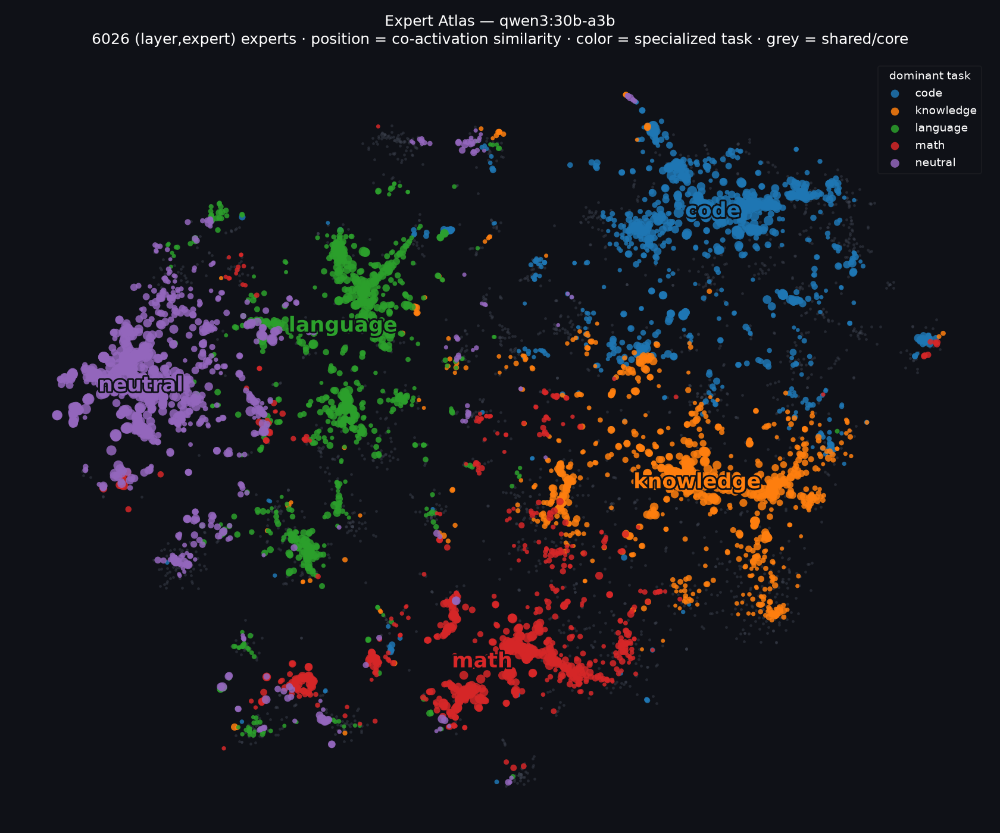
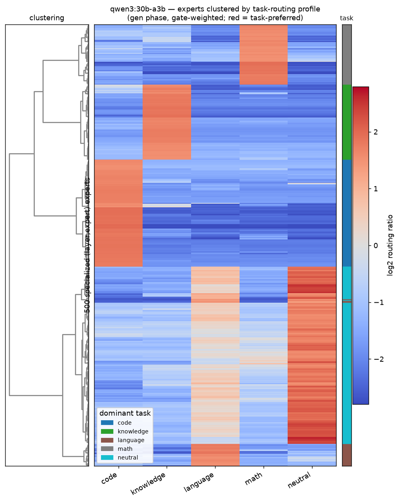
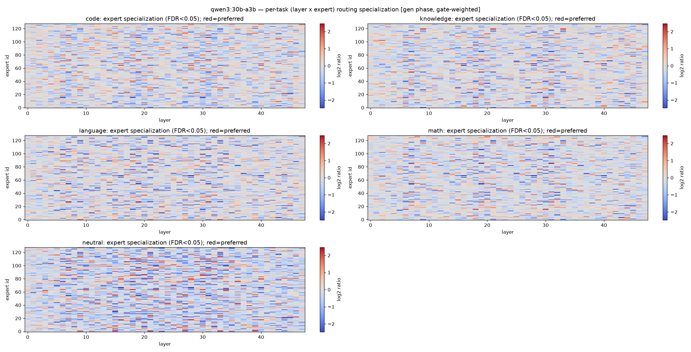
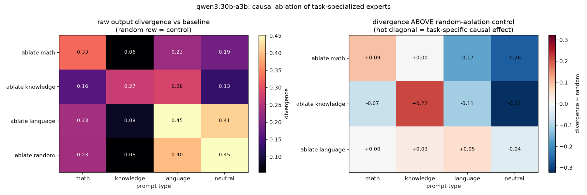

# moe-vis — MoE expert-activation tracing, heatmaps & causal validation

See **which experts ("sub-models") a Mixture-of-Experts LLM activates**, broken
down by task type, using a custom-patched [Ollama](https://ollama.com) build —
then quantify, visualize, and **causally validate** the specialization.

Reference model: **`qwen3:30b-a3b`** (qwen3moe: 48 layers, 128 experts, top-8
routing) on **CPU**, across five prompt categories (math, code, knowledge,
language, and a content-free *neutral* control).

## Headline result

**Expert Atlas** — every used `(layer, expert)` expert is one point, positioned
by co-activation similarity (experts recruited on the *same prompts* sit together,
via t-SNE) and colored by the task it specializes for. The model self-organizes
into task "continents"; grey is the shared/core used by everything:



The same structure as a clustered matrix (experts × tasks, cluster purity ≈ 1.0)
and FDR-masked per-task `(layer × expert)` maps:




---

## How it works

### 1. The trace patch (`patches/expert-trace.patch`)

Ollama runs MoE models through bundled **llama.cpp / ggml**. The patch adds an
opt-in hook (active only when `$OLLAMA_EXPERT_TRACE` is set) that records, per
token:

| what | where it's hooked | record |
|------|-------------------|--------|
| **selected experts** | `ggml_mul_mat_id` (both `ggml-cpu.c` *and* `repack.cpp`) | `{"layer":L,"name":"ffn_moe_down-L","experts":[[...]]}` |
| **gating weights** | dispatcher post-op on `ffn_moe_weights` | `{"wlayer":L,"weights":[[...]]}` |
| **ablation** | dispatcher pre-argsort on `ffn_moe_probs` | masks `$OLLAMA_ABLATE_EXPERTS` to −inf |

> **Two gotchas, both load-bearing:**
> 1. ggml *repacks* quantized expert weights into a blocked layout with its
>    **own** `mul_mat_id` kernel in `repack.cpp`. Hooking only `ggml-cpu.c`
>    silently captures ~half the layers. The patch hooks both.
> 2. A given expert index is **per-layer** — expert 40 in layer 3 is a different
>    network from expert 40 in layer 20. All analysis keeps `(layer, expert)` as
>    the unit and never sums an index across layers.

### 2. The harness (`harness/`)

| script | role |
|--------|------|
| `fetch_benchmarks.py` | 25 prompts/category from HF datasets-server (GSM8K, HumanEval, MMLU, opus-100 en→fr) + gold answers + a neutral control set. |
| `run_trace.py` | Drive the patched server (serialized, `think:false`), slice the trace by byte offset per request, pair experts with gating weights, **split prefill vs generation**, validate captured layers == `block_count`. → `activations.npz` |
| `analyze_heatmap.py` | Per-task `(layer,expert)` specialization with **significance testing** + coverage metrics. |
| `cluster_heatmap.py` | Hierarchically cluster specialized experts by task profile. |
| `expert_atlas.py` | t-SNE map of experts by co-activation similarity — the headline figure. |
| `ablate_validate.py` | **Causal test**: ablate each task's top experts and measure task-specific accuracy loss. |

### 3. Methodology (what makes the numbers trustworthy)

- **Generation phase, not prefill.** Counts use the model's own generated tokens
  by default (`MOE_PHASE=gen`), which removes most shared instruction-wrapper
  bias that pollutes prompt tokens. Prefill is stored separately.
- **Gate-weighted.** Each activation is weighted by its routing probability, not
  a binary top-k membership (`MOE_WEIGHTED=1`).
- **Pseudocount-smoothed.** Routing fractions use a Dirichlet pseudocount so
  rarely-used experts can't produce explosive near-zero-baseline ratios.
- **Significance-tested.** Per `(task, layer, expert)`, a Welch z-test of that
  task's prompts vs. the rest, with **Benjamini-Hochberg FDR** control; heatmaps
  are masked to significant cells.
- **Neutral control.** A content-free category as a routing baseline.
- **Causally validated** by ablation (below) — correlation alone isn't claimed.

---

## Reproduce

### 0. Prerequisites

CPU is enough (no GPU). Need **Go ≥ 1.26**, **CMake ≥ 3.24**, a C/C++ compiler,
**git**, **Python 3.10+**, ~30 GB disk, internet.

```bash
python3 -m venv venv && ./venv/bin/pip install cmake ninja numpy scipy scikit-learn matplotlib
cp env.sh.example env.sh   # edit paths, then:  source env.sh
```

### 1. Build the patched Ollama

The patch targets the llama.cpp revision Ollama **v0.30.5** pins (`b9509`);
Ollama auto-applies any `*.patch` under `llama/compat/`.

```bash
git clone --depth 1 --branch v0.30.5 https://github.com/ollama/ollama.git ollama-src
cp patches/expert-trace.patch ollama-src/llama/compat/
cd ollama-src && cmake -B build . && cmake --build build --parallel && cd ..
```

A different Ollama version pins a different llama.cpp, so the patch may need
regenerating (it touches two functions in `ggml-cpu.c` and one in `repack.cpp`).

### 2. Pull a model

```bash
ollama pull qwen3:30b-a3b      # ~18 GB; any MoE model works
```

### 3. Trace, analyze, visualize, validate

```bash
source env.sh && cd harness
python fetch_benchmarks.py     # benchmarks.json (+ gold answers, neutral set)
python run_trace.py            # activations.npz  (~13 min for 110 prompts)
python analyze_heatmap.py      # specialization heatmaps + significance + coverage
python expert_atlas.py         # headline: expert co-activation map (t-SNE)
python cluster_heatmap.py      # clustered experts-x-tasks matrix
python ablate_validate.py      # causal ablation (~9 min; restarts server x4)
```

---

## Outputs

| file | meaning |
|------|---------|
| `expert_atlas.png` | t-SNE map of experts by co-activation; task continents (headline). |
| `heatmap_clustered.png` | specialized experts clustered into per-task blocks. |
| `heatmap_specialization_LE.png` | per-task `(layer × expert)` specialization, FDR-masked. |
| `task_overlap.png` | Jaccard overlap of each task's preferred experts. |
| `routing_entropy.png` | per-task per-layer routing concentration. |
| `ablation_validation.png` | output divergence when ablating each task's experts, per prompt type. |
| `specialization_significant.csv` | significant `(layer,expert)` cells per task. |
| `activations.npz` | per-request gen/prefill, count/weighted tensors for custom analysis. |

## Causal validation (ablation)

`ablate_validate.py` forces a task's top-N experts out of routing (scores → −inf)
and measures the **causal effect** as how much the model's greedy output changes.
Generating full correct answers from a 30B reasoning model on CPU is too slow for
a multi-condition sweep, so instead of accuracy we measure **output divergence**:
generate a short deterministic continuation with vs. without ablation and compare
them token-for-token.

The claim being tested is **specificity** — ablating a task's experts should
change *that task's* prompts far more than neutral/other-task prompts, and more
than random ablation does (a hot diagonal once you subtract the random control):



In the reference run, ablating a task's experts perturbs that task's outputs
above the random-ablation baseline (knowledge +0.22, math +0.09, language +0.05),
while off-diagonal effects are ~0 or negative — i.e. the specialization is
causal and task-specific, strongly for math/knowledge and weakly for language.

## Customizing

`run_trace.py` env: `MOE_MODEL`, `MOE_NUM_PREDICT`, `MOE_LIMIT`, `MOE_PORT`,
`OLLAMA_BIN`. Analysis env: `MOE_PHASE` (gen|pre), `MOE_WEIGHTED`, `MOE_ALPHA`,
`MOE_PSEUDOCOUNT`. Ablation env: `MOE_ABLATE_N`, `MOE_EVAL_N`, `MOE_EVAL_TOK`.

## Caveats

- Routing reflects the *generated token mix*; with a reasoning model some
  "thinking" style remains even at `think:false`.
- Specialization is measured against the in-set baseline (the five categories);
  adding very different tasks would shift it.
- Causal validation uses output divergence rather than task accuracy (cheap
  enough for a reasoning model on CPU); it shows the experts are *causally
  influential and task-specific*, not the exact accuracy cost of removing them.

## Repo layout

```
patches/expert-trace.patch   the ggml trace + weights + ablation hooks
harness/                     fetch / run / analyze / cluster / ablate
results/                     example figures from the reference run
env.sh.example               toolchain PATH template
```

The Ollama tree, llama.cpp clone, venv, and generated artifacts are not
committed (`.gitignore`); the steps above recreate them.
