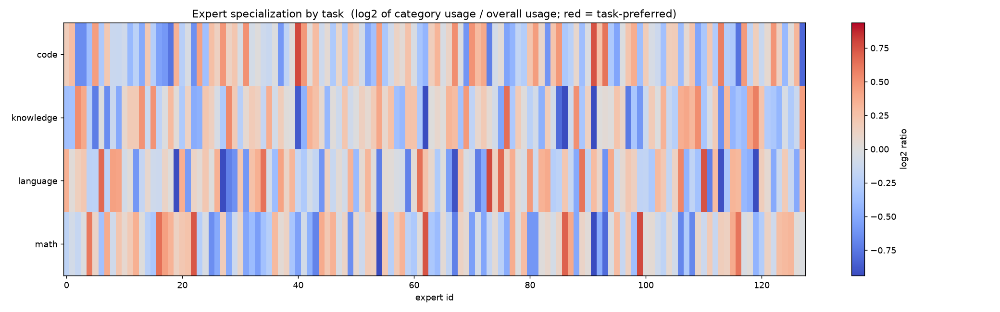
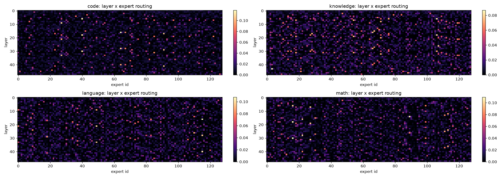

# moe-vis — MoE expert-activation tracing & heatmaps

See **which experts ("sub-models") a Mixture-of-Experts LLM activates**, broken
down by benchmark task type, using a custom-patched [Ollama](https://ollama.com)
build — then render heatmaps.

The reference run traces **`qwen3:30b-a3b`** (qwen3moe: 48 layers, 128 experts,
top-8 routing) on **CPU**, across four task categories (math, code, knowledge,
language).

## Example output

Expert specialization per task — `log2(task usage / overall usage)`; red = an
expert this task prefers, blue = one it avoids:



Per-task layer × expert routing:



Stable, reproducible specialization (consistent across run sizes), e.g.:

| task | top task-preferred experts |
|------|----------------------------|
| code | e40, e91, e93, e113, e67 |
| math | e99, e62, e22, e86, e16 |
| language | e73, e110, e75, e6, e61 |
| knowledge | e76, e119, e28, e109, e2 |

---

## How it works

Ollama runs MoE models through its bundled **llama.cpp / ggml**. Every expert
gather is a `ggml_mul_mat_id` op whose `src[2]` is the per-token
`selected_experts` tensor (int32, shape `[n_expert_used, n_tokens]`), with the
layer encoded in its name `ffn_moe_topk-<il>`.

`patches/expert-trace.patch` adds a function `ollama_trace_experts()` that appends
one JSON line per op to the file named by `$OLLAMA_EXPERT_TRACE`:

```json
{"layer":12,"name":"ffn_moe_down-12","n_used":8,"n_tokens":1,"experts":[[40,91,7,...]]}
```

It is a no-op when the env var is unset, so a patched build behaves identically to
a stock build until you opt in.

> **Important:** ggml *repacks* quantized expert weights into a blocked layout
> (`CPU_REPACK`) that has its **own** `mul_mat_id` kernel in `repack.cpp`, separate
> from the generic one in `ggml-cpu.c`. The patch hooks **both** kernels. Hooking
> only `ggml-cpu.c` silently captures ~half the layers and no gate/up ops — if you
> see fewer layers than the model has, this is why.

The Python harness (`harness/`, stdlib + `numpy` + `matplotlib` only):

| script | role |
|--------|------|
| `fetch_benchmarks.py` | Pull 25 prompts/category from the HuggingFace datasets-server REST API (GSM8K, HumanEval, MMLU, opus-100 en→fr). Writes `benchmarks.json`. |
| `run_trace.py` | Launch the patched server with `OLLAMA_EXPERT_TRACE` set and `OLLAMA_NUM_PARALLEL=1` (serialized requests), send each prompt, slice the trace file by byte offset to attribute lines to that request, aggregate per-request `(layer, expert)` counts → `activations.npz`. |
| `analyze_heatmap.py` | Build the heatmaps + `category_expert_fraction.csv`. |

---

## Reproduce

### 0. Prerequisites

- Linux/macOS, **CPU is enough** (no GPU required; reference box was a 48-core
  Xeon / 62 GB RAM, GPU unused).
- **Go ≥ 1.26**, **CMake ≥ 3.24**, a C/C++ compiler (gcc/g++ or clang), **git**,
  **Python 3.10+**.
- ~30 GB free disk (ollama source + fetched llama.cpp + build + an ~18 GB model).
- Internet access (clones, model pull, benchmark fetch).

If Go/CMake aren't system-wide, install them into your home dir, e.g.:

```bash
# Go
curl -sL https://go.dev/dl/go1.26.4.linux-amd64.tar.gz | tar -C $HOME/sdk -xz   # -> $HOME/sdk/go
# CMake + Ninja via a venv (also used for numpy/matplotlib)
python3 -m venv venv && ./venv/bin/pip install cmake ninja numpy matplotlib
cp env.sh.example env.sh   # edit paths, then:  source env.sh
```

### 1. Build the patched Ollama

The patch is generated against the llama.cpp revision Ollama **v0.30.5** pins
(`b9509`). Ollama's build auto-applies any `*.patch` under `llama/compat/`.

```bash
git clone --depth 1 --branch v0.30.5 https://github.com/ollama/ollama.git ollama-src
cp patches/expert-trace.patch ollama-src/llama/compat/
cd ollama-src
cmake -B build .                 # fetches llama.cpp b9509 and applies the patch
cmake --build build --parallel   # builds ggml + llama runner + the ollama binary
cd ..
# -> patched binary at ollama-src/ollama
```

Using a **different Ollama version** pins a different llama.cpp, so the patch may
not apply. If `cmake -B build` reports the patch failed, regenerate it (the change
is small — two functions): clone the matching llama.cpp, add the
`ollama_trace_experts` helper + call shown in `patches/expert-trace.patch` to both
`ggml/src/ggml-cpu/ggml-cpu.c` (`ggml_compute_forward_mul_mat_id`) and
`ggml/src/ggml-cpu/repack.cpp` (`forward_mul_mat_id`), then `git diff > patch`.

### 2. Pull the MoE model

```bash
ollama pull qwen3:30b-a3b      # ~18 GB; any MoE model works (see Customizing)
```

### 3. Trace and plot

```bash
source env.sh
cd harness
./run_all.sh                   # fetch_benchmarks -> run_trace -> analyze_heatmap
# or step by step:
#   python fetch_benchmarks.py    # -> benchmarks.json
#   python run_trace.py           # -> activations.npz
#   python analyze_heatmap.py     # -> *.png + category_expert_fraction.csv
```

`run_trace.py` starts its own patched server on port 11435 (configurable) using
your existing `~/.ollama` model store, so it won't clash with a running Ollama.

---

## Outputs

| file | meaning |
|------|---------|
| `heatmap_specialization.png` | `log2(category usage / overall usage)` per expert — the clearest "which experts map to which task". |
| `heatmap_category_expert.png` | Raw expert-usage fraction per category. |
| `heatmap_layers.png` | Per-category layer × expert routing grid. |
| `category_expert_fraction.csv` | The underlying per-(category, expert) numbers. |
| `activations.npz` | Per-request `(layer, expert)` count tensors for custom analysis. |

## Customizing

Environment knobs for `run_trace.py`:

| var | default | meaning |
|-----|---------|---------|
| `MOE_MODEL` | `qwen3:30b-a3b` | any MoE model in your Ollama store (e.g. `gpt-oss:20b`, `granite3.1-moe:3b`) |
| `MOE_NUM_PREDICT` | `96` | tokens generated per prompt |
| `MOE_LIMIT` | `0` (all) | cap prompts per category (quick smoke runs) |
| `MOE_PORT` | `11435` | server port |
| `OLLAMA_BIN` | `ollama-src/ollama` | path to the patched binary |

Edit the dataset → category mapping in `fetch_benchmarks.py` to trace other tasks.

## Caveats

- Reasoning models (qwen3) emit "thinking" tokens even for short answers, so the
  routing reflects that token mix. To trace only task output, disable thinking
  (`"think": false`) and/or separate prefill from generation.
- Counts are over all tokens (prompt + generated). Per-token / per-position
  breakdowns are available from `activations.npz` if you extend the analysis.

## Repo layout

```
patches/expert-trace.patch   the ggml trace hook (apply during the Ollama build)
harness/                     fetch / run / analyze scripts + run_all.sh
results/                     example heatmaps + CSV from the reference run
env.sh.example               toolchain PATH template
```

The Ollama source tree, the llama.cpp reference clone, the venv, and generated
artifacts are intentionally **not** committed (see `.gitignore`); they are
recreated by the steps above.
